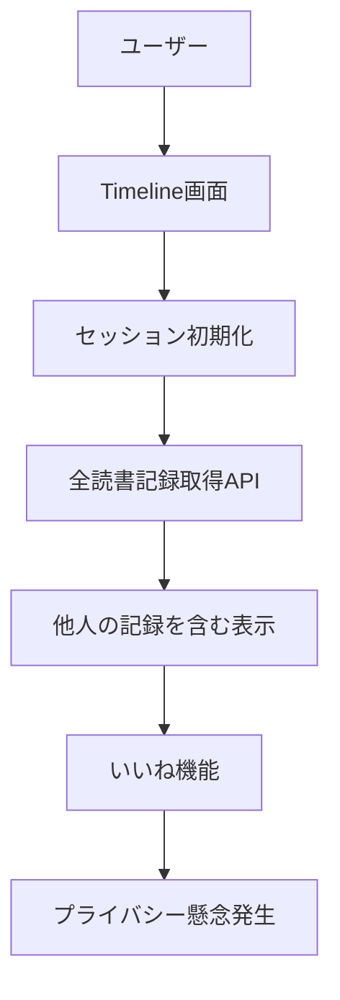

# タイムライン機能除却要件設計書

## 概要

### プロジェクト概要
本設計書は、GitHubイシュー#171「タイムライン機能を除却する」の実装に関する詳細な要件定義書です。ユーザーのプライバシー保護を目的として、他人の読書記録が閲覧可能なタイムライン機能を完全に削除し、個人専用の読書記録アプリとして再構築します。

### 背景と目的
- **背景**: 現在のタイムライン機能では、全ユーザーの読書記録が共有表示され、ユーザーのプライバシーに対する懸念が発生
- **仮説**: ユーザーは自分のメモを他人に見られることを望んでいない
- **目的**: プライバシー保護により、ユーザーの安心感を向上させ、メモ登録数の増加を図る
- **期待効果**: ユーザーのメモは本人のみが閲覧可能となり、アプリ利用意欲が向上

## 現状分析

### 現在のタイムライン機能構成

#### **フロントエンド構成**
```typescript
// Timeline.tsx (436行) - メインコンポーネント
- 全ユーザーの読書記録表示
- いいね機能 (❤️/🤍)
- ネタバレフィルタリング
- セッション管理による匿名アクセス対応
- テキスト展開機能
- テーマ表示機能
```

#### **API構成**
```typescript
// バックエンド API エンドポイント
GET  /api/reading-records          // 全読書記録取得（他人含む）
POST /api/reading-records/:id/like // いいね追加
DELETE /api/reading-records/:id/like // いいね削除
POST /api/session                  // セッション生成（匿名アクセス用）
GET  /api/user-settings           // ネタバレ表示設定
```

#### **ルーティング構成**
```typescript
// App.tsx - ルート定義
<Route path="/timeline" element={<Timeline />} />

// ハンバーガーメニュー - ナビゲーションリンク
<Link to="/timeline">🌟 タイムライン</Link>
```

### データフロー分析


## 除却要件詳細

### Phase 1: フロントエンド除却項目

#### **1.1 コンポーネント削除**
- **対象ファイル**: `frontend/src/components/Timeline.tsx` (436行)
- **削除理由**: タイムライン表示機能の完全廃止
- **影響範囲**: 
  - 全ユーザー記録表示機能
  - いいね機能UI
  - ネタバレフィルタリング機能
  - セッション管理ロジック

#### **1.2 ルーティング削除**
- **対象箇所**: `frontend/src/App.tsx:212-216`
```typescript
// 削除対象
<Route path="/timeline" element={
  <div className="container mx-auto px-1 sm:px-4 pt-0 pb-2 sm:pb-8 max-w-2xl w-full overflow-x-hidden mb-20 md:mb-2">
    <Timeline />
  </div>
} />
```

#### **1.3 ナビゲーションリンク削除**
- **対象箇所**: `frontend/src/App.tsx:105-111`
```typescript
// 削除対象
<Link
  to="/timeline"
  onClick={() => setIsMenuOpen(false)}
  className="block px-4 py-3 text-gray-700 hover:bg-orange-50 hover:text-orange-700 transition-colors"
>
  🌟 タイムライン
</Link>
```

### Phase 2: バックエンドAPI除却項目

#### **2.1 全読書記録取得API削除**
- **対象エンドポイント**: `GET /api/reading-records`
- **削除理由**: 他人の読書記録へのアクセス防止
- **影響**: セッション管理による匿名アクセス機能の廃止

#### **2.2 いいね機能API削除**
- **対象エンドポイント**: 
  - `POST /api/reading-records/:id/like`
  - `DELETE /api/reading-records/:id/like`
- **削除理由**: 社会的機能の廃止
- **影響**: like_count、is_likedフィールドの使用停止

#### **2.3 セッション管理API削除**
- **対象エンドポイント**: `POST /api/session`
- **削除理由**: 匿名アクセス機能の廃止
- **影響**: 認証必須システムへの変更

### Phase 3: データベース影響分析

#### **3.1 テーブル構造への影響**
```sql
-- 影響を受けるフィールド（使用停止）
ALTER TABLE reading_records 
  -- like_count: 使用停止（削除は行わない）
  -- セッション関連の匿名アクセス制御: 廃止
```

#### **3.2 データ保持方針**
- **完全保持**: 既存の読書記録データ
- **機能停止**: いいね関連フィールド
- **アクセス制限**: ユーザー認証必須

## 保持対象機能

### **個人機能（完全保持）**
```typescript
// 継続利用される機能
✅ MyPage - 個人読書記録表示
✅ 読む機能 - ReadingPage  
✅ メモ機能 - InputForm
✅ 書く機能 - DraftOutputPage
✅ 認証システム - AuthContext
✅ 設定機能 - SettingsPage
✅ Q&A機能 - QAPage
✅ Bottom Navigation Bar
```

### **API継続利用**
```typescript
// 個人向けAPI（認証必須）
✅ POST /api/reading-records      // 個人記録作成
✅ GET  /api/user-reading-records // 個人記録取得
✅ PUT  /api/reading-records/:id  // 個人記録更新
✅ DELETE /api/reading-records/:id // 個人記録削除
✅ 認証関連API                   // ログイン・認証
```

## 新システム設計

### **認証要件の変更**

#### **Before (現在)**
```typescript
// 匿名ユーザーでもタイムライン閲覧可能
const sessionId = localStorage.getItem('sessionId');
// セッションベースの匿名アクセス
```

#### **After (変更後)**
```typescript
// 全機能で認証必須
const { isAuthenticated, token } = useAuth();
if (!isAuthenticated) {
  return <AuthScreen />;
}
```

### **ナビゲーション構成の変更**

#### **Before (現在)**
1. 🏠 ホーム（未認証時）
2. 📊 ダッシュボード（認証済み）
3. 🌟 **タイムライン**（全ユーザー）← 削除対象
4. ⚙️ 設定（認証済み）
5. ❓ Q&A（全ユーザー）
6. 📍 場所を探す（外部リンク）
7. 🚪 ログアウト（認証済み）

#### **After (変更後)**
1. 🏠 ホーム（未認証時）
2. 📊 ダッシュボード（認証済み）
3. ⚙️ 設定（認証済み）
4. ❓ Q&A（全ユーザー）
5. 📍 場所を探す（外部リンク）
6. 🚪 ログアウト（認証済み）

### **エラーハンドリング設計**

#### **旧URL対応**
```typescript
// /timeline へのアクセス対応
<Route path="/timeline" element={
  <Navigate to="/mypage" replace />
} />
```

#### **認証エラー対応**
```typescript
// 未認証ユーザーの全機能アクセス制限
const ProtectedRoute = ({ children }) => {
  const { isAuthenticated } = useAuth();
  return isAuthenticated ? children : <Navigate to="/auth" />;
};
```

## 実装手順

### **Phase 1: フロントエンド除却**
1. **Timeline.tsxコンポーネント削除**
2. **App.tsxルート削除**
3. **ハンバーガーメニューリンク削除**
4. **関連import文削除**

### **Phase 2: バックエンド除却**
1. **タイムライン用API削除**
2. **いいね機能API削除**
3. **セッション管理API削除**
4. **関連import・関数削除**

### **Phase 3: リダイレクト設定**
1. **旧タイムラインURL → MyPage**
2. **未認証ユーザー → 認証画面**
3. **エラーページの適切な表示**

### **Phase 4: 検証・テスト**
1. **個人機能動作確認**
2. **認証フロー確認**
3. **データ保持確認**
4. **パフォーマンステスト**

## リスク分析と対策

### **High Risk: データ損失**
- **リスク**: 既存読書記録の意図しない削除
- **対策**: 
  - データベース完全バックアップ
  - テーブル削除は行わず、機能停止のみ
  - ロールバック可能な段階的実装

### **Medium Risk: ユーザー体験の変化**
- **リスク**: タイムライン利用ユーザーの困惑
- **対策**:
  - MyPageでの個人記録アクセス強化
  - 適切なリダイレクト設定
  - ユーザー向け変更通知

### **Low Risk: 既存機能への影響**
- **リスク**: 個人機能の意図しない動作不良
- **対策**:
  - 個人向けAPI完全保持
  - 認証システムの継続利用
  - 段階的な機能テスト

## 検証計画

### **機能検証項目**

#### **✅ 個人機能保持確認**
1. MyPageでの個人記録表示
2. 読む/メモ/書く機能の正常動作
3. 認証フローの継続動作
4. 設定・Q&A機能の保持

#### **✅ 除却確認**
1. /timeline URLの適切なリダイレクト
2. タイムラインリンクの完全削除
3. 他人記録へのアクセス不可
4. いいね機能の完全停止

#### **✅ セキュリティ確認**
1. 未認証ユーザーのアクセス制限
2. 認証トークンの適切な検証
3. 個人データの適切な保護

### **パフォーマンス検証**
- **読み込み速度**: タイムライン削除による高速化確認
- **データベース負荷**: クエリ削減効果確認
- **フロントエンドバンドルサイズ**: コンポーネント削除による軽量化

## 成果物

### **削除予定ファイル**
1. `frontend/src/components/Timeline.tsx` - タイムラインメインコンポーネント

### **修正予定ファイル**
1. `frontend/src/App.tsx` - ルーティング・ナビゲーション修正
2. `backend/src/index.ts` - API削除・修正
3. `backend/src/database.ts` - 関連関数削除

### **新規追加ファイル**
1. リダイレクト用の適切な処理（必要に応じて）

## データ移行戦略

### **移行不要項目**
- 読書記録データ: 完全保持
- ユーザーアカウント: 変更なし
- 認証システム: 継続利用

### **機能移行**
- タイムライン → MyPage: 個人記録のみ表示
- 全体記録閲覧 → 廃止
- いいね機能 → 廃止

## 予想される効果

### **プライバシー保護**
- ✅ 他人による読書記録閲覧の完全防止
- ✅ ユーザーの安心感向上
- ✅ よりパーソナルな読書記録アプリへの変革

### **アプリ使用促進**
- ✅ メモ登録数の増加（プライバシー懸念解消）
- ✅ ユーザーエンゲージメントの向上
- ✅ 個人向け機能への集中

### **システム最適化**
- ✅ 不要な社会的機能削除による軽量化
- ✅ セキュリティの向上（認証必須化）
- ✅ メンテナンス負荷の軽減

---

## 実装上の注意事項

1. **データ保護最優先**: 既存ユーザーの読書記録は絶対に削除しない
2. **段階的実装**: 一度にすべてを削除せず、段階的に除却
3. **ロールバック準備**: 万が一の場合のロールバック戦略を準備
4. **ユーザー通知**: 変更内容の適切なユーザー向け通知

## 関連イシュー
- **GitHub Issue #171**: タイムライン機能を除却する
- **優先度**: High（高）
- **分類**: Enhancement（新機能）

---

*この設計書は、ユーザーのプライバシー保護と読書記録アプリの個人化を目的とした重要な機能変更の指針として機能します。実装過程で詳細な調整が必要な場合は、この文書を更新し関係者に共有してください。*