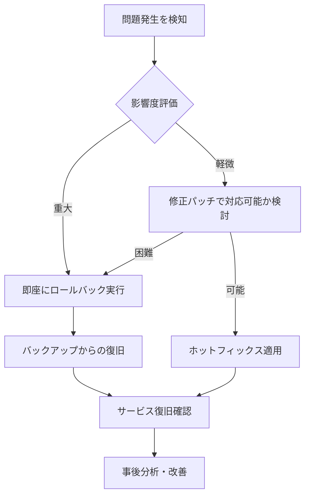

# 🔄 データベースロールバックガイド

マイグレーション実行後に問題が発生した場合の緊急対応手順です。

## ⚠️ 緊急時の対応フロー



## 📋 ロールバック実行手順

### 1. 事前準備・状況確認

```bash
# 現在のデータベース状態確認
psql -c "
SELECT schemaname, tablename, tableowner 
FROM pg_tables 
WHERE schemaname = 'public'
ORDER BY tablename;
"

# 最近のテーブル変更履歴確認
psql -c "
SELECT schemaname, tablename, attname, atttypid::regtype
FROM pg_attribute
JOIN pg_class ON pg_attribute.attrelid = pg_class.oid
JOIN pg_namespace ON pg_class.relnamespace = pg_namespace.oid
WHERE schemaname = 'public' AND attname NOT LIKE '%ctid%'
ORDER BY tablename, attnum;
"
```

### 2. バックアップ確認

```bash
# Supabaseの場合：自動バックアップ確認
# ダッシュボード > Settings > Database > Backups

# 手動バックアップがある場合
pg_dump -h your-host -U postgres -d ichidan_dokusho > backup_before_rollback.sql
```

## 🗃️ 機能別ロールバック手順

### writing_themes機能のロールバック

#### 手順1: アプリケーションのダウンタイム対応

```bash
# メンテナンスモードに設定（Netlifyの場合）
# /_redirects ファイルに以下を追加：
# /*    /maintenance.html   503

# Renderの場合：環境変数でメンテナンスモード有効化
```

#### 手順2: データのバックアップ

```sql
-- 削除前にデータを保存
CREATE TABLE writing_themes_backup AS 
SELECT * FROM writing_themes;

-- 確認
SELECT COUNT(*) FROM writing_themes_backup;
```

#### 手順3: テーブル・関連オブジェクトを削除

```sql
-- トリガー削除
DROP TRIGGER IF EXISTS update_writing_themes_updated_at ON writing_themes;

-- インデックス削除
DROP INDEX IF EXISTS idx_writing_themes_user_id;
DROP INDEX IF EXISTS idx_writing_themes_created_at;

-- テーブル削除
DROP TABLE IF EXISTS writing_themes CASCADE;

-- 確認
SELECT table_name FROM information_schema.tables 
WHERE table_name = 'writing_themes';
```

#### 手順4: アプリケーションコードのロールバック

```bash
# 該当機能のコードを無効化
# 方法1: 環境変数でフィーチャーフラグ制御
export ENABLE_WRITING_THEMES=false

# 方法2: 緊急時は該当ルートを無効化
# backend/src/index.ts で該当APIルートをコメントアウト
```

### spoiler_fields機能のロールバック

```sql
-- user_settingsテーブルのカラム削除
ALTER TABLE user_settings 
DROP COLUMN IF EXISTS hide_spoilers;

-- reading_recordsテーブルのカラム削除
ALTER TABLE reading_records 
DROP COLUMN IF EXISTS contains_spoiler,
DROP COLUMN IF EXISTS notes,
DROP COLUMN IF EXISTS is_not_book,
DROP COLUMN IF EXISTS custom_link;

-- user_settingsテーブル自体の削除（慎重に実行）
DROP TABLE IF EXISTS user_settings CASCADE;
```

## 🔍 ロールバック後の確認事項

### 1. データベース整合性確認

```sql
-- テーブル構造確認
\dt

-- 外部キー制約確認
SELECT 
    tc.table_name,
    kcu.column_name,
    ccu.table_name AS foreign_table_name,
    ccu.column_name AS foreign_column_name
FROM information_schema.table_constraints AS tc
JOIN information_schema.key_column_usage AS kcu
  ON tc.constraint_name = kcu.constraint_name
  AND tc.table_schema = kcu.table_schema
JOIN information_schema.constraint_column_usage AS ccu
  ON ccu.constraint_name = tc.constraint_name
  AND ccu.table_schema = tc.table_schema
WHERE tc.constraint_type = 'FOREIGN KEY';

-- シーケンス確認
SELECT sequence_name FROM information_schema.sequences;
```

### 2. アプリケーション動作確認

```bash
# API Health Check
curl -f https://your-api-domain.com/health

# 基本機能確認
curl -f https://your-api-domain.com/api/reading-records

# フロントエンド確認
# ブラウザでアプリケーションアクセス
# - ログイン機能
# - 読書記録追加
# - タイムライン表示
```

### 3. エラーログ監視

```bash
# バックエンドログ確認（Renderの場合）
# ダッシュボードのLogsセクションを確認

# フロントエンドエラー確認
# ブラウザDevToolsのConsoleタブ確認

# データベースエラー確認（Supabaseの場合）
# ダッシュボード > Logs > Database Logs
```

## 📊 完全復旧手順（バックアップからの復元）

### Supabaseでの完全復旧

```bash
# 1. 新しいデータベースインスタンス作成
# Supabaseダッシュボード > New Project

# 2. バックアップからの復元
psql -h new-db-host -U postgres -d postgres < backup_file.sql

# 3. アプリケーションの接続先変更
# 環境変数を新しいデータベースに変更
export DATABASE_URL="new-connection-string"

# 4. DNS・ロードバランサーの切り替え
# 新しいインスタンスにトラフィックを向ける
```

## 🚨 緊急時の連絡先・手順

### 1. インシデント対応チーム

- **技術責任者**: [連絡先]
- **データベース管理者**: [連絡先]
- **インフラ担当者**: [連絡先]

### 2. エスカレーション手順

1. **Level 1**: 開発チーム内で対応（30分以内）
2. **Level 2**: 技術責任者にエスカレーション
3. **Level 3**: 外部ベンダー（Supabase等）サポートに連絡

### 3. 緊急時コミュニケーション

```bash
# Slackチャンネル: #incident-response
# 報告形式：
# 🚨 INCIDENT: [問題の概要]
# 📊 Impact: [影響範囲]
# 🔄 Action: [実行中の対応]
# ⏰ ETA: [復旧予想時間]
```

## 📈 事後対応・改善

### 1. ポストモーテム実施

- **インシデント発生原因の分析**
- **対応時間・手順の評価**
- **改善点の洗い出し**
- **予防策の策定**

### 2. 改善アクション例

```markdown
## 改善アクション
- [ ] マイグレーション前のテストケース強化
- [ ] 自動ロールバック機能の実装
- [ ] 監視アラートの閾値調整
- [ ] バックアップ頻度の見直し
- [ ] チーム内訓練の実施
```

### 3. ドキュメント更新

- 発生した問題と解決方法をドキュメント化
- ロールバック手順の改善点を反映
- チーム内でナレッジ共有

---

## 📞 サポート

ロールバック実行時に不明な点がある場合は、即座に技術責任者に連絡してください。
**データの整合性よりも、まずはサービス復旧を優先**してください。